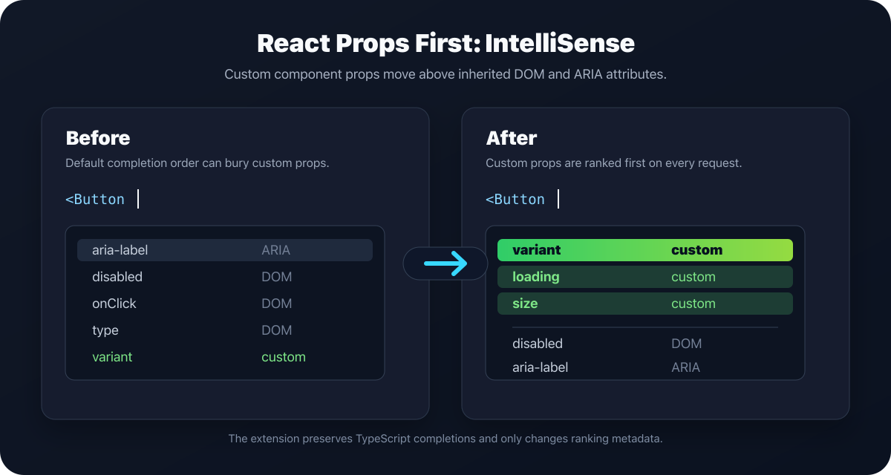

# React Props First: IntelliSense

React Props First is a VS Code extension for React IntelliSense that prioritizes custom JSX and TSX props before inherited DOM and ARIA attributes in autocomplete.



Use it when component-specific props like `variant`, `size`, or `loading` are buried below inherited attributes such as `disabled`, `onClick`, and `aria-label`.

## Install

Install React Props First from the [Visual Studio Marketplace](https://marketplace.visualstudio.com/items?itemName=yurii.react-props-first), or run:

```sh
code --install-extension yurii.react-props-first
```

## How it works

React Props First hooks into TypeScript's completion pipeline through a TypeScript server plugin. TypeScript still produces the normal IntelliSense completion list; the plugin only changes each completion item's `sortText`.

When completion is requested inside a JSX opening tag, the plugin:

1. Finds the JSX component at the cursor.
2. Asks TypeScript for the component's props type.
3. Checks where each prop was declared.
4. Ranks props declared in project or component code before props inherited from React, DOM, and ARIA types.

For example, in this component:

```tsx
interface ButtonProps extends React.ButtonHTMLAttributes<HTMLButtonElement> {
  variant?: "primary" | "secondary";
  loading?: boolean;
}

function Button(props: ButtonProps) {
  return <button {...props} />;
}
```

`variant` and `loading` are ranked before inherited DOM and ARIA attributes like `disabled`, `onClick`, and `aria-label`.

## Supported usage

React Props First works best with typed React components in `.tsx` files:

```tsx
<Button />
```

It also supports `.jsx` files when TypeScript can infer the component's props, most commonly through JSDoc:

```jsx
/**
 * @typedef {React.ButtonHTMLAttributes<HTMLButtonElement> & {
 *   variant?: "primary" | "secondary",
 *   loading?: boolean
 * }} ButtonProps
 */

/** @param {ButtonProps} props */
function Button(props) {
  return <button {...props} />;
}
```

Plain untyped JSX is not reliable because JavaScript does not define a formal prop type:

```jsx
function Button(props) {
  return <button {...props} />;
}
```

In that exact case, TypeScript does not know which custom props exist, so the extension cannot prioritize custom props.

The extension does not change completions outside JSX attribute-name positions, and it does not add, remove, or rewrite completion items.

## Settings

- `reactPropsFirst.enabled`: enable or disable completion ordering.
- `reactPropsFirst.enableJavaScript`: enable ordering in `.jsx` files when TypeScript can infer component props.
- `reactPropsFirst.debug`: write diagnostic messages to the TypeScript server log.

## Development

```sh
npm install
npm test
```

## Marketplace

Check the published extension metadata and download count:

```sh
npx vsce show yurii.react-props-first
```

Publisher dashboard:

```text
https://marketplace.visualstudio.com/manage/publishers/yurii
```

## Contributing

### Commits

Use [Conventional Commits](https://www.conventionalcommits.org/) for commit messages.

Examples:

- `feat: add jsx prop completion ranking`
- `fix: avoid sorting outside jsx attributes`
- `chore: update lint configuration`

## Demo


